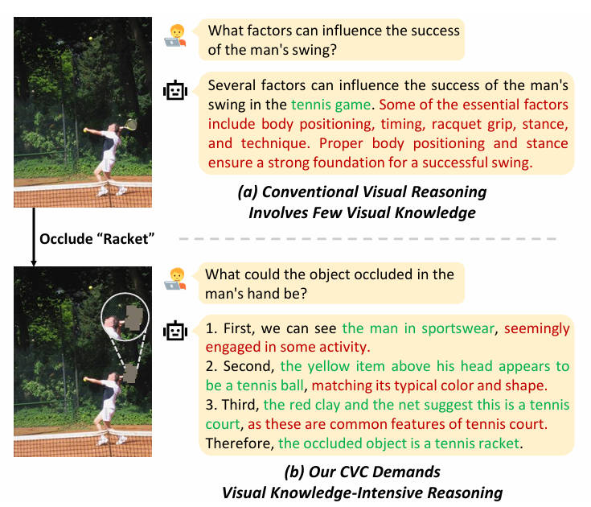

# CVC
Code for "Boosting Visual Knowledge-Intensive Training for LVLMs through Causality-driven Visual Object Completion" (IJCAI 2025)


<p align="center">
  
</p>

## Data Preparation

### High-Causality Entity Collection

1. Download the [COCO dataset](https://github.com/salesforce/LAVIS/blob/main/lavis/datasets/download_scripts/download_coco.py) using [LAVIS](https://github.com/salesforce/LAVIS).
2. Format the input into a JSON list. Each entry should contain:
    ```json
    {
        "image": "image file",
        "text_input": "image caption"
    }
    ```

3. Extract entities for each caption:
    ```bash
    python cvc/data_preparation/1-0_entity_extractor.py
    ```

4. Tag the causality for each entity:
    ```bash
    python cvc/data_preparation/1-1_causality_tagger.py
    ```

---

### Image Occlusion

1. Use [GLIP](https://github.com/microsoft/GLIP) to detect bounding boxes of high-causality entities. Download the [GLIP checkpoint](https://huggingface.co/GLIPModel/GLIP/blob/main/glip_large_model.pth) and run the following script within the GLIP repository:

    ```bash
    python cvc/data_preparation/2-1_detect_bbox.py
    ```

2. Use [SAM](https://huggingface.co/facebook/sam-vit-huge) to mask high-causality objects:
    ```bash
    python cvc/data_preparation/2-2_segment.py
    ```

3. Generate the specific instruction for each high-causality entity:
    ```bash
    python cvc/data_preparation/2_instruction_generator.py
    ```


## Model Training

### Trial Sampling

1. Sample multiple rationales (trials) for each CVC instance:
    ```bash
    python cvc/model_training/1_cot_generator_llava.py
    ```

2. Extract the final answer from each trial:
    ```bash
    python cvc/model_training/2_answer_extractor.py
    ```

3. Verify the correctness of each trial's answer using soft matching with the [BGE-M3](https://huggingface.co/BAAI/bge-m3) embedding model.
    ```bash
    python cvc/model_training/3_answer_checker.py
    ```

### Trial Learning
1. Collect challenging successful CVC instances and construct the training data using hybrid formats. The resulting dataset is combined with [the instruction data of LLaVA-1.5](https://huggingface.co/datasets/liuhaotian/LLaVA-Instruct-150K/blob/main/llava_v1_5_mix665k.json):
    ```bash
    python cvc/model_training/4_hybrid_format.py
    ```


2. Download [the pretrained checkpoint of LLaVA-1.5](https://huggingface.co/liuhaotian/llava-v1.5-mlp2x-336px-pretrain-vicuna-7b-v1.5) and use [the official LLaVA training script](https://github.com/haotian-liu/LLaVA/blob/main/scripts/v1_5/finetune.sh) for model training.


## 🤝 Acknowledgements

This project builds upon the excellent work of several open-source repositories. We sincerely thank the authors for their contributions:

- [LLaVA](https://github.com/haotian-liu/LLaVA): for the base LVLM architecture and training pipeline
- [LAVIS](https://github.com/salesforce/LAVIS): for dataset downloading
- [GLIP](https://github.com/microsoft/GLIP): for object detection

Please make sure to install all required dependencies as specified in the respective repositories.
